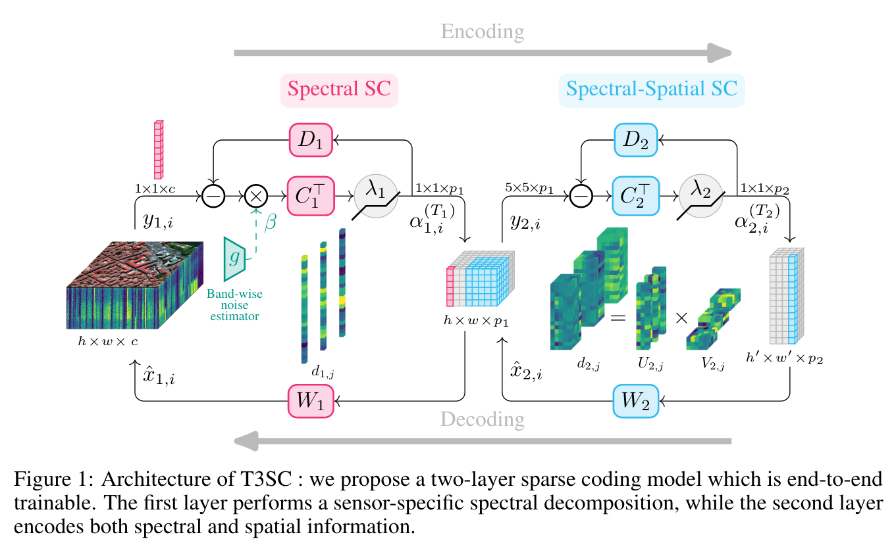
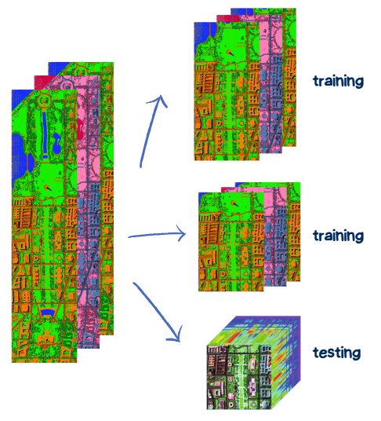

# A Trainable Spectral-Spatial Sparse Coding Model for Hyperspectral Image Restoration
## Explorating noise complexity on the dataset dcmall

This repository contains codes, slide presentation of our final project in the Computational Imaging course at IMT Atlantique (Brest 2025).
Members:
- Nathan SALBEGO
- Xueyun WENG

This project is inspired by [this paper](https://proceedings.neurips.cc/paper/2021/file/2b515e2bdd63b7f034269ad747c93a42-Paper.pdf). The original repository is available [here](https://github.com/inria-thoth/T3SC).

## 1. Introduction
Trainable spectral-spatial sparse coding model(T3SC)is a powerful hybrid approach that combines Deep Learning and Sparse Coding to effectively denoise hyperspectral images. Its is a 2-layer architecture:
- 1) The first layer decomposes the spectrum measured at each pixel as a sparse linear combination of a few elements from a learned dictionary, thus performing a form of linear spectral unmixing per pixel
- 2) The second layer builds upon the output of the first one, which is represented as a two-dimensional feature map, and sparsely encodes patches on a dictionary in order to take into account spatial relationships between pixels within small receptive fields.



Starting with the code implementation from the initial repository, we've tested [some pre-trained model](https://pascal.inrialpes.fr/data2/tbodrito/t3sc/). Moreover, as part of this project, we have focused mainly in explorying the performance of the model with complex noise on the input dataset dcmall. 

## 2. Initial repo review
### 2.1. Testing: ICVL dataset
### 2.2. Training and testing: dcmall dataset
Washington DC Mall is one of the most widely used dataset for HSI denoising and consists of a high-quality image of size 1280 × 307 with 191 bands. We split the image into two sub-images of size 600 × 307 and 480 × 307 for training and one sub-image of size 200 × 200 for testing. 
There is no pre-trained model for the washington dcmall hyperspectral dataset. Therefore, we've trained two models with Noise Adaptive Sparse Coding (model.beta=1) 



dcmall dataset with band-dependant gaussian noise $\sigma=55$ :
```
$ python main.py data=dcmall model.beta=1 noise=uniform noise.params.sigma_max=55
```
dcmall dataset with stripes noise :
```
$ python main.py data=dcmall model.beta=1 noise=stripes
```

## 3. Exploring complex noise on dcmall 
### 3.1. Complex noises overview

### 3.2. Training model

### 3.3. Experiments and Results


