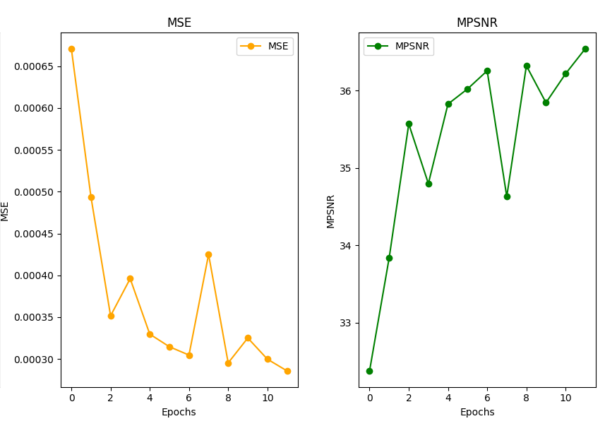

# A Trainable Spectral-Spatial Sparse Coding Model for Hyperspectral Image Restoration
## Explorating noise complexity on the dataset dcmall

This repository contains codes, slide presentation of our final project in the Computational Imaging course at IMT Atlantique (Brest 2025).
Members:
- Nathan SALBEGO
- Xueyun WENG

This project is inspired by [this paper](https://proceedings.neurips.cc/paper/2021/file/2b515e2bdd63b7f034269ad747c93a42-Paper.pdf). The original repository is available [here](https://github.com/inria-thoth/T3SC).

## 1. Introduction
Trainable spectral-spatial sparse coding model(T3SC)is a powerful hybrid approach that combines Deep Learning and Sparse Coding to effectively denoise hyperspectral images. Its is a 2-layer architecture:
- 1) The first layer decomposes the spectrum measured at each pixel as a sparse linear combination of a few elements from a learned dictionary, thus performing a form of linear spectral unmixing per pixel
- 2) The second layer builds upon the output of the first one, which is represented as a two-dimensional feature map, and sparsely encodes patches on a dictionary in order to take into account spatial relationships between pixels within small receptive fields.


Starting with the code implementation from the initial repository, we've tested [some pre-trained model](https://pascal.inrialpes.fr/data2/tbodrito/t3sc/). Moreover, as part of this project, we have focused mainly in explorying the performance of the model with complex noise on the input dataset dcmall. 

## 2. Testing robustness to various types of noise
### 2.1. ICVL dataset
ICVL is a hyperspectral image dataset, collected by "Sparse Recovery of Hyperspectral Signal from Natural RGB Images" At this time it contains 200 images and will continue to grow progressively.Images were collected at 1392 $\times$ 1300 spatial resolution over 519 spectral bands.


### 2.2 Using the pre-trained models

Some pre-trained models can be found [here](http://pascal.inrialpes.fr/data2/tbodrito/t3sc/).

### 2.3 Testing on various parameters of noise

Here is the command to launch the testing with a pre-trained model on various noises : 
```
$ python main.py mode=test data=icvl noise={constant,uniform,correlated,stripes} [+noise-specific params] model.ckpt=path/to/ckpt
```

**NOTE:** Some noises require to add model.beta=1 and use Noise-adaptative sparse coding

### 2.4 Observations

| Paramètre      | MPSNR (entrée) | MPSNR (sortie) | SSIM (entrée) | SSIM (sortie) |
|-----------------|----------------|----------------|---------------|---------------|
| Constant 50     | 15.82 dB       | 41.25 dB       | 0.0536        | 0.9626        |
| Constant 25     | 21.16 dB       | 44.40 dB       | 0.1606        | 0.9799        |
| Constant 100    | 10.78 dB       | 38.17 dB       | 0.0159        | 0.9367        |
| Constant 5      | 34.30 dB       | 51.64 dB       | 0.7677        | 0.9955        |
| Correlated      | 28.58 dB       | 48.82 dB       | 0.4788        | 0.9913        |
| Uniform 15      | 15.23 dB       | 40.12 dB       | 0.0847        | 0.9614        |
| Uniform 55      | 20.01 dB       | 43.82 dB       | 0.1192        | 0.9742        |
| Uniform 95      | 22.48 dB       | 47.01 dB       | 0.2981        | 0.9833        |
| Stripes         | 16.81 dB       | 41.81 dB       | 0.2335        | 0.9682        |

## 3. Exploring band-dependant gaussian noise on dcmall
### 3.1. Training: dcmall dataset
Washington DC Mall is one of the most widely used dataset for HSI denoising and consists of a high-quality image of size 1280 × 307 with 191 bands. We split the image into two sub-images of size 600 × 307 and 480 × 307 for training and one sub-image of size 200 × 200 for testing. 


There is no pre-trained model for the washington dcmall hyperspectral dataset. Therefore, we've trained a models with Noise Adaptive Sparse Coding (model.beta=1) on the dataset dcmall dataset with band-dependant gaussian noise $\sigma=55$ :
```
$ python main.py data=dcmall model.beta=1 noise=uniform noise.params.sigma_max=55
```
During the training, we track some metrics : loss, MSE, and the Mean Peak Signal-to-Noise Ratio (MPSNR)



At epoch 11, we got the best trade-off between loss and MPSNR so we kept this checkpoint as our best model.

### 3.2. Testing: dcmall dataset
Since we've trained the model with a Gaussian noise with band-dependent variance $\sigma=55$, we want to test it using similar input dataset with gaussian noise but with different variance. Here are the inference for band-dependant gaussian noise with different values of $\sigma$. The Mean Peak Signal-to-Noise Ratio (MPSNR) and the Mean Structural Similarity Index Measurement (MSSIM) are two possible metrics used to evaluate the quality of the inference.  

To perform some inference using the checkpoint:
```
$ python main.py mode=test data=dcmall model.beta=1 noise=uniform noise.params.sigma_max=x model.ckpt="/path/to/ckpt"
```

Where $\sigma=x$ can be choosen by the user.

**NOTE:** Keep in mind that since the model has been trained using with Noise Adaptive Sparse Coding (model.beta=1), it should also be tested with it


### 3.3. Observation
It can be observed that for variance extremely lower than $\sigma=55$ (noticeable starting from $\sigma=35$), the MPSNR and MSSIM show that the putput-reconstructed image is even worse quality than the input-noisy image. However, for $\sigma>=55$, the metrics are better. 

Below are input-noisy images and output-reconstructed images for 2 different values of $\sigma$:

$\sigma$ |input-noisy | output-reconstructed | MPSNR in | MPSNR out | MSSIM in | MSSIM out
:---:|:---:|:---:|:---:|:---:|:---:|:---:
15 || |22.46|38.63|0.74|0.99
55 || |33.32|4.57|0.95|-0.03
85 || |19.02|37.36 |0.62|0.99

## 4. Conclusion
### 4.1. Training time and resource consumption
### 4.1. Inference time
### 4.1. To go further


